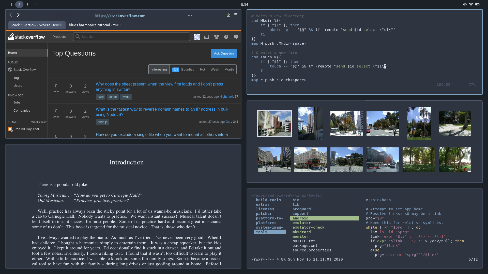
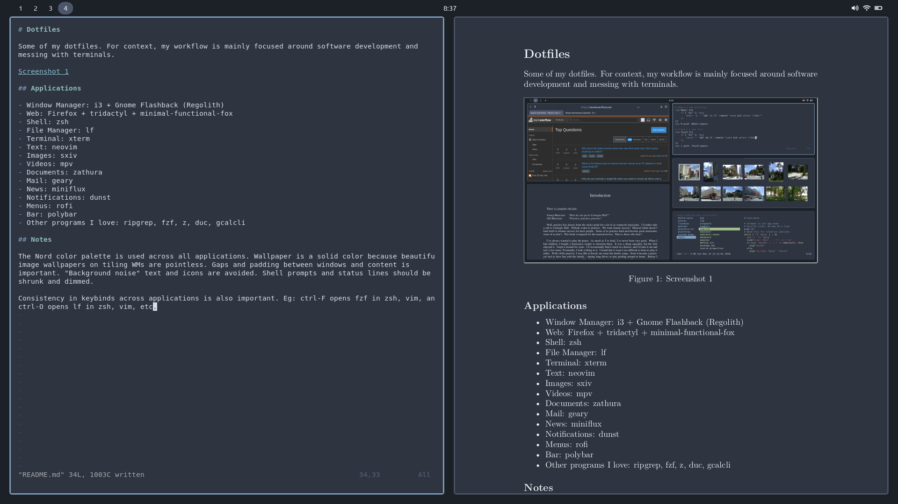

# Dotfiles

Some of my dotfiles. For context, my workflow is mainly focused around software development and
messing with terminals.

## Applications

- Window Manager: i3 + Gnome Flashback (Regolith)
- Web: Firefox + tridactyl + minimal-functional-fox
- Shell: zsh
- File Manager: lf
- Terminal: xterm
- Text: neovim
- Images: sxiv
- Videos: mpv
- Documents: zathura
- Mail: geary
- News: miniflux
- Notifications: dunst
- Menus: rofi
- Bar: polybar
- Other programs I love: ripgrep, fzf, z, duc, gcalcli

## Notes

The Nord color palette is used across all applications. Wallpaper is a solid color because beautiful
image wallpapers on tiling WMs are pointless. Gaps and padding between windows and content is
important. "Background noise" text and icons are avoided. Shell prompts and status lines should be
shrunk and dimmed.

Consistency in keybinds across applications is also important. Eg: ctrl-F opens fzf in zsh, vim, and lf.
ctrl-O opens lf in zsh, vim, etc.
